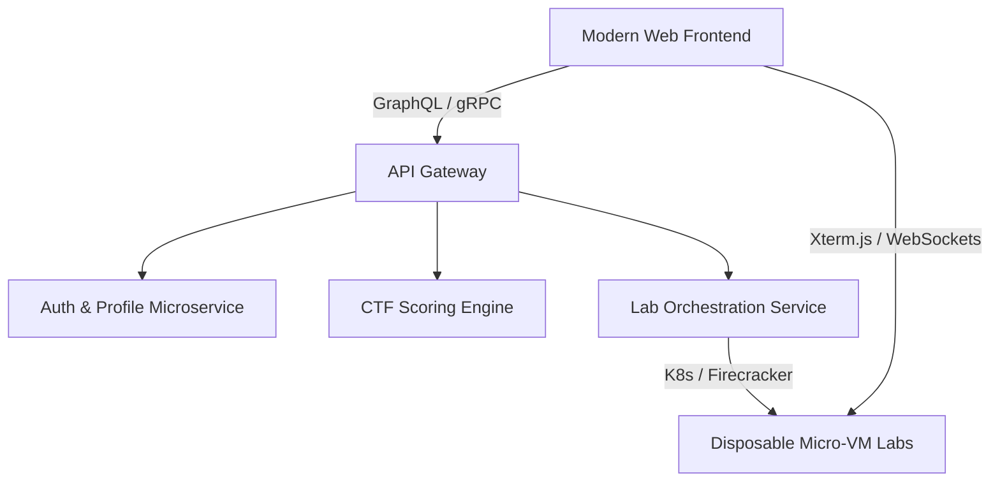

# Hacklido Learn — Platform Analysis & Future Blueprint

Welcome to the documentation and development roadmap for **Hacklido Learn** (`https://learn.hacklido.com/`). This README provides a comprehensive breakdown of the current landing page, functional modules, and learning structure of the Hacklido Learn platform. 

Furthermore, it outlines a **futuristic, professional architecture blueprint** designed to elevate the user experience, aesthetic design, and technical capabilities of the platform to a state-of-the-art interactive learning management system (LMS).

---

## 📖 Table of Contents
1. [Overview & Core Mission](#-overview--core-mission)
2. [Current Platform Analysis](#-current-platform-analysis)
   - [Visual Layout & User Flow](#visual-layout--user-flow)
   - [Core Features & Content Areas](#core-features--content-areas)
   - [Suggested Current Tech Stack](#suggested-current-tech-stack)
3. [Futuristic Transformation Blueprint](#-futuristic-transformation-blueprint)
   - [Premium Aesthetic & UI/UX Upgrades](#premium-aesthetic--uiux-upgrades)
   - [Advanced Technical Architecture](#advanced-technical-architecture)
   - [Next-Gen Features](#next-gen-features)
4. [Suggested Next-Gen Tech Stack](#-suggested-next-gen-tech-stack)
5. [Getting Started & Implementation Phase](#-getting-started--implementation-phase)

---

## 🎯 Overview & Core Mission

**Hacklido Learn** is a hands-on cybersecurity training platform designed to bridge the gap between theoretical concept mastery and real-world penetration testing/defensive security execution. Following the principle of **"learning by doing,"** Hacklido Learn guides students through structured curricula, interactive labs, and gamified Capture The Flag (CTF) environments.

### The Problem it Solves:
* **The Theory Trap:** Prevents students from getting stuck in "tutorial hell" by forcing immediate practical application.
* **Complex Lab Setups:** Lowers the entry barrier for learners by offering ready-to-run targets and sandboxed arenas.
* **Vague Skill Progression:** Provides clear, visual learning paths mapped directly to recognized certifications and job roles.

---

## 🔍 Current Platform Analysis

### Visual Layout & User Flow
The platform greets users with a sleek, tech-focused dark interface designed to appeal to the hacker/developer aesthetic.
1. **Header / Navigation:** 
   - Logo and platform branding.
   - Main navigation: **Learning Paths**, **Arenas (CTF/Blue Team/Root Quest)**, **Pricing/Access**, and **User Dashboard/Profile**.
2. **Hero Section:**
   - Bold typography emphasizing hands-on training.
   - Clear Call-to-Action (CTA) buttons: *Start Learning*, *Explore Arenas*.
3. **Structured Learning Paths Grid:**
   - Showcases available curricula (Web Security, Prompt Engineering, OS fundamentals, etc.) with completion metrics and badge rewards.
4. **Interactive Arenas:**
   - Dedicated dashboard cards linking to active lab modules.
5. **Footer:**
   - Social links, terms, and community access pathways connecting back to the main Hacklido article hub.

### Core Features & Content Areas

| Module | Sub-Category | Focus & Topics Covered |
| :--- | :--- | :--- |
| **Learning Paths** | **Web Security & PenTesting** | OSCP/PEN-200 prep, OWASP Top 10 vulnerabilities, API security. |
| | **AI & Prompt Engineering** | AI exploitation, prompt injection defenses, LLM guardrails. |
| | **OS & Infrastructure** | Linux CLI mastery, Windows Privilege Escalation, Active Directory basics. |
| | **Python for Pentesters** | Automated reconnaissance scripts, exploit automation, custom tooling. |
| **Hands-on Arenas** | **Pocket CTFs** | Small, modular challenges: Web, Cryptography, Reverse Engineering, Forensics, OSINT. |
| | **Blue Team** | Threat detection, incident response, SIEM log analysis, network forensics. |
| | **Root Quest** | Advanced system exploitation, buffer overflows, kernel privilege escalation. |
| **Validation** | **Certificates** | Verifiable digital credentials awarded on successful path completion. |

### Suggested Current Tech Stack
Historically, platforms of this type utilize a combination of:
* **Frontend:** React.js / Next.js, styled with Tailwind CSS.
* **Backend:** Node.js (Express) or Python (Django/FastAPI) to handle authentication, scoring, and progress tracking.
* **Database:** PostgreSQL or MongoDB.
* **Lab Orchestration:** Docker containers spun up dynamically or accessed via browser-based VPN/VNC/xterm.js.

---

## 🚀 Futuristic Transformation Blueprint

To convert the current platform into a premium, world-class educational tool, the following enhancements are proposed:

### Premium Aesthetic & UI/UX Upgrades
1. **Glassmorphism & Depth:**
   - Move from flat dark backgrounds to layered, semi-transparent frosted glass elements (glassmorphism) over subtle moving neon gradients.
2. **Dynamic Cyber-Punk Typography:**
   - Integrate custom mono and display typefaces (e.g., *JetBrains Mono*, *Space Grotesk*) paired with glowing text effects for interactive code and terminal screens.
3. **Micro-Animations & Transitions:**
   - Use Framer Motion to create smooth interactive paths, accordion expansions, and glowing hover states on challenge cards.
4. **Interactive Roadmaps:**
   - Replace standard grids with an interactive, branching skill-tree SVG map that lights up as the user completes nodes (similar to MMORPG talent trees).

### Advanced Technical Architecture
1. **Zero-Setup Terminal Emulator:**
   - Integrate an in-browser terminal using **xterm.js** backed by **WebAssembly (Wasm)** or remote micro-VMs. Users should be able to run `nmap`, `hydra`, or `gobuster` directly from the web browser without installing tools locally.
2. **Edge-Computed Verification:**
   - Move submission checks and lightweight exercises to edge functions (Cloudflare Workers / Vercel Edge) to decrease latency and eliminate serverside scoring lags.
3. **Real-time Leaderboards:**
   - Use server-sent events (SSE) or WebSockets to stream live scoreboards, activity feeds, and system alerts (e.g., *"User_X just rooted Machine_Y!"*).

### Next-Gen Features
* **AI Security Coach:** A side-by-side chat companion powered by a fine-tuned LLM that gives contextual hints (without giving away the flag) when a user gets stuck.
* **Multiplayer Duel Mode:** 1v1 cybersecurity speed battles where two players race to exploit the same target machine, with live dashboard metrics showing progress side-by-side.
* **Automated Lab Audits:** A system that automatically tears down idle VM containers after inactivity, optimizing cloud server costs.

---

## 🛠️ Suggested Next-Gen Tech Stack

If you choose to rebuild or heavily upgrade the platform, this cutting-edge stack is recommended:

* **Frontend Framework:** `Next.js 14+` (App Router) for high-speed server rendering, SEO optimization, and file-based routing.
* **Styling & Animation:** `Tailwind CSS v4` combined with `Framer Motion` for premium animations and HSL-based dark mode colors.
* **Database & Auth:** `Supabase` or `PostgreSQL` with `Prisma ORM` for database querying, with built-in real-time subscription support.
* **Interactive Terminal & Labs:** `xterm.js` connected to secure, isolated micro-containers hosted via `AWS ECS/Fargate` or `Fly.io` using `Firecracker` micro-VMs.
* **AI Assistance:** `Vercel AI SDK` paired with Google Gemini Pro API for custom tutor chat widgets.

---

*This document is created as a starting point. Feel free to clone this workspace, customize the structure, and begin prototyping the next iteration of **Hacklido Learn**.*
